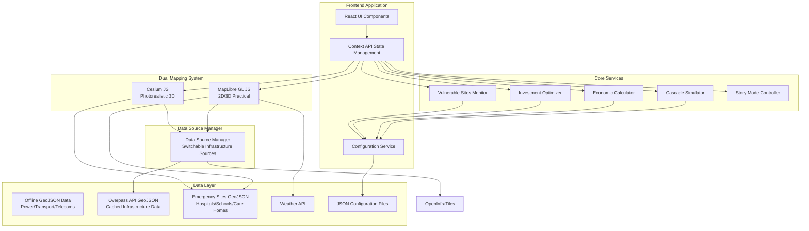

# Design Document

## Overview

The CReDo Infrastructure Resilience Platform is architected as a modern React-based web application with dual mapping engines to provide both practical 2D/3D visualization and photorealistic 3D presentation capabilities. The system employs a configuration-driven approach for economic modeling and cascade simulation rules, enabling rapid customization without code changes.

The platform integrates multiple data sources including offline GeoJSON datasets for major UK cities, real-time Overpass API data, and weather data to provide comprehensive infrastructure analysis and simulation capabilities.

## Architecture

### High-Level System Architecture



### Component Architecture

The application follows a layered architecture with clear separation of concerns:

1. **Presentation Layer**: React components with Tailwind CSS styling
2. **State Management Layer**: React Context API with custom hooks
3. **Service Layer**: Business logic services for simulation and analysis
4. **Data Access Layer**: Configuration service and data loading utilities
5. **Mapping Layer**: Dual rendering engines (MapLibre + Cesium)

## Components and Interfaces

### Core React Components

#### MapContainer Component
```typescript
interface MapContainerProps {
  viewMode: '2d' | '3d' | 'photorealistic';
  onViewModeChange: (mode: ViewMode) => void;
  selectedAsset?: Asset;
  cascadeState: CascadeState;
  layerVisibility: LayerVisibilityState;
}

const MapContainer: React.FC<MapContainerProps> = ({
  viewMode,
  onViewModeChange,
  selectedAsset,
  cascadeState,
  layerVisibility
}) => {
  // Renders either MapLibreView or CesiumView based on viewMode
  // Manages view transitions and state synchronization
};
```

#### EconomicDashboard Component
```typescript
interface EconomicDashboardProps {
  economicImpact: EconomicImpact;
  isSimulationActive: boolean;
  onExportReport: () => void;
}

interface EconomicImpact {
  totalCost: number;
  costPerHour: number;
  affectedPopulation: number;
  vulnerableSitesCount: number;
  breakdown: {
    directCosts: number;
    businessDisruption: number;
    emergencyResponse: number;
    recoveryCosts: number;
  };
  duration: number; // in minutes
}
```

#### LayerController Component
```typescript
interface LayerControllerProps {
  layers: LayerDefinition[];
  visibility: LayerVisibilityState;
  dataSource: DataSourceType;
  onVisibilityChange: (layerId: string, visible: boolean) => void;
  onOpacityChange: (layerId: string, opacity: number) => void;
  onDataSourceChange: (source: DataSourceType) => void;
}

interface LayerDefinition {
  id: string;
  name: string;
  type: 'infrastructure' | 'vulnerable-sites' | 'flood-zones' | 'criticality';
  defaultVisible: boolean;
  defaultOpacity: number;
  color: string;
  supportedSources: DataSourceType[];
}

type DataSourceType = 'tiles' | 'geojson';

interface DataSourceInfo {
  id: DataSourceType;
  name: string;
  description: string;
  status: 'available' | 'loading' | 'error';
  coverage: string;
  lastUpdated?: Date;
}
```

### Service Interfaces

#### CascadeSimulator Service
```typescript
interface CascadeSimulator {
  initializeSimulation(triggerId: string, config: CascadeConfig): Promise<void>;
  stepSimulation(): CascadeStepResult;
  resetSimulation(): void;
  getCurrentState(): CascadeState;
  subscribeToUpdates(callback: (state: CascadeState) => void): () => void;
}

interface CascadeConfig {
  radiusKm: number;
  delaySeconds: number;
  severity: number; // 0-1
  crossSectorEnabled: boolean;
  economicMultipliers: EconomicMultipliers;
}

interface CascadeState {
  isActive: boolean;
  triggerId: string;
  affectedAssets: Map<string, AssetState>;
  currentStep: number;
  totalSteps: number;
  elapsedTime: number; // in minutes
}

interface AssetState {
  id: string;
  status: 'normal' | 'degraded' | 'failed' | 'offline';
  impactTime: number; // minutes since cascade start
  downstreamCount: number;
}
```

#### EconomicCalculator Service
```typescript
interface EconomicCalculator {
  calculateImpact(affectedAssets: Asset[], duration: number): EconomicImpact;
  calculateRealTimeUpdate(newAsset: Asset, currentImpact: EconomicImpact): EconomicImpact;
  applyTimeMultipliers(baseImpact: EconomicImpact, timestamp: Date): EconomicImpact;
  generateCostBreakdown(affectedAssets: Asset[]): CostBreakdown;
}

interface CostBreakdown {
  directInfrastructure: number;
  businessDisruption: number;
  emergencyResponse: number;
  populationImpact: number;
  vulnerableSitesImpact: number;
}
```

#### InvestmentOptimizer Service
```typescript
interface InvestmentOptimizer {
  calculateCriticality(assets: Asset[]): AssetCriticality[];
  optimizeInvestments(budget: number, options: InvestmentOption[]): InvestmentPlan;
  generateInvestmentReport(plan: InvestmentPlan): InvestmentReport;
}

interface AssetCriticality {
  assetId: string;
  criticalityScore: number; // 0-100
  downstreamCount: number;
  sectorsAffected: string[];
  economicImpactPerHour: number;
  isSinglePointOfFailure: boolean;
  vulnerabilityFactors: VulnerabilityFactors;
}

interface InvestmentOption {
  assetId: string;
  name: string;
  cost: number;
  riskReductionPercent: number;
  cascadePreventionCount: number;
  estimatedBenefit: number;
  roi: number;
  paybackPeriodYears: number;
  priority: 'CRITICAL' | 'HIGH' | 'MEDIUM' | 'LOW';
}
```

### Configuration System

#### ConfigurationService
```typescript
interface ConfigurationService {
  loadEconomicMultipliers(): Promise<EconomicMultipliers>;
  loadCascadeRules(): Promise<CascadeRules>;
  loadInvestmentTemplates(): Promise<InvestmentTemplates>;
  loadVulnerableSites(): Promise<VulnerableSiteConfig>;
  validateConfiguration<T>(data: unknown, schema: ZodSchema<T>): T;
}

// Configuration file structures
interface EconomicMultipliers {
  version: string;
  lastUpdated?: string;
  baseCosts: {
    powerOutagePerHour: number;
    powerSubstationPerHour: number;
    transportDisruptionPerHour: number;
    transportHubPerHour: number;
    telecomFailurePerHour: number;
    waterServiceDisruptionPerHour: number;
    sewageOverflowPerHour: number;
  };
  multipliers: {
    peakHours: {
      weekdayMorning: number;
      weekdayEvening: number;
      weekend: number;
      offPeak: number;
    };
    weatherSeverity: Record<string, number>;
    businessDisruptionFactor: number;
    emergencyResponseMultiplier: number;
  };
  populationImpacts: {
    costPerPersonPerHour: number;
    vulnerablePersonMultiplier: number;
    businessClosureCost: number;
    schoolClosureCost: number;
  };
  oneTimeCosts: Record<string, number>;
  recoveryCosts: Record<string, number>;
}
```

## Data Models

### Core Asset Model
```typescript
interface Asset {
  id: string;
  name: string;
  type: 'power_substation' | 'transport_hub' | 'telecom_tower' | 'water_facility';
  location: [number, number]; // [lng, lat]
  properties: {
    capacity?: number;
    voltage?: number;
    servicePopulation: number;
    backupPowerMinutes?: number;
    criticalityScore?: number;
  };
  dependencies: string[]; // Asset IDs this depends on
  dependents: string[]; // Asset IDs that depend on this
  vulnerabilityFactors: VulnerabilityFactors;
  metadata: Record<string, any>;
}

interface VulnerabilityFactors {
  ageYears: number;
  floodRiskLevel: number; // 1-5
  weatherExposure: number; // 1-5
  redundancyAvailable: boolean;
  maintenanceScore: number; // 1-5
}
```

### Vulnerable Site Model
```typescript
interface VulnerableSite {
  id: string;
  name: string;
  type: 'hospital' | 'care_home' | 'school' | 'military' | 'data_center' | 'emergency_services';
  location: [number, number];
  priority: 'CRITICAL' | 'HIGH' | 'MEDIUM';
  capacity: number; // beds, students, etc.
  backupPowerMinutes: number;
  dependencies: string[]; // Infrastructure asset IDs
  stakeholders: Stakeholder[];
  evacuationComplexity: 'low' | 'medium' | 'high' | 'very_high' | 'critical';
  alternativeServiceRadiusKm?: number;
}

interface Stakeholder {
  name: string;
  role: string;
  contact: {
    email: string;
    phone: string;
    sms: string;
  };
  notificationTriggers: string[];
  escalationTimeMinutes: number;
}
```

## Error Handling

### Error Handling Strategy

The application implements a multi-layered error handling approach:

1. **Configuration Validation**: Zod schemas validate all JSON configuration files at startup
2. **Network Resilience**: Retry mechanisms for tile loading and API requests
3. **Graceful Degradation**: Fallback behaviors when components fail
4. **User Feedback**: Clear error messages and recovery suggestions

#### Error Boundary Implementation
```typescript
interface ErrorBoundaryState {
  hasError: boolean;
  error?: Error;
  errorInfo?: ErrorInfo;
  errorType: 'config' | 'network' | 'rendering' | 'unknown';
}

class InfrastructureErrorBoundary extends React.Component<Props, ErrorBoundaryState> {
  static getDerivedStateFromError(error: Error): Partial<ErrorBoundaryState> {
    return {
      hasError: true,
      error,
      errorType: classifyError(error)
    };
  }

  componentDidCatch(error: Error, errorInfo: ErrorInfo) {
    // Log error details for debugging
    console.error('Infrastructure Platform Error:', error, errorInfo);
    
    // Attempt recovery based on error type
    this.attemptRecovery(error);
  }
}
```

#### Configuration Error Handling
```typescript
async function loadConfigurationWithValidation<T>(
  path: string, 
  schema: ZodSchema<T>
): Promise<T> {
  try {
    const response = await fetch(path);
    if (!response.ok) {
      throw new ConfigurationError(`Failed to load ${path}: ${response.statusText}`);
    }
    
    const data = await response.json();
    const result = schema.safeParse(data);
    
    if (!result.success) {
      const errorDetails = result.error.flatten();
      throw new ConfigurationError(
        `Configuration validation failed for ${path}`,
        errorDetails
      );
    }
    
    return result.data;
  } catch (error) {
    if (error instanceof ConfigurationError) {
      throw error;
    }
    throw new ConfigurationError(`Unexpected error loading ${path}`, error);
  }
}
```

## Testing Strategy

### Unit Testing Approach

The testing strategy focuses on critical business logic and user interactions:

#### Service Layer Testing
```typescript
describe('CascadeSimulator', () => {
  let simulator: CascadeSimulator;
  let mockConfig: CascadeConfig;
  let mockAssets: Asset[];

  beforeEach(() => {
    simulator = new CascadeSimulator();
    mockConfig = createMockCascadeConfig();
    mockAssets = createMockAssetNetwork();
  });

  test('should identify dependent assets within radius', async () => {
    await simulator.initializeSimulation('power_sub_001', mockConfig);
    const state = simulator.getCurrentState();
    
    expect(state.affectedAssets.size).toBeGreaterThan(1);
    expect(state.affectedAssets.has('transport_hub_001')).toBe(true);
  });

  test('should apply timing delays correctly', async () => {
    const startTime = Date.now();
    await simulator.initializeSimulation('power_sub_001', mockConfig);
    
    // Step through simulation
    const step1 = simulator.stepSimulation();
    const step2 = simulator.stepSimulation();
    
    expect(step2.timestamp).toBeGreaterThan(step1.timestamp);
  });
});
```

#### Component Testing
```typescript
describe('EconomicDashboard', () => {
  test('should display animated cost counter', () => {
    const mockImpact: EconomicImpact = {
      totalCost: 1500000,
      costPerHour: 250000,
      affectedPopulation: 50000,
      vulnerableSitesCount: 3,
      breakdown: {
        directCosts: 500000,
        businessDisruption: 750000,
        emergencyResponse: 100000,
        recoveryCosts: 150000
      },
      duration: 180
    };

    render(<EconomicDashboard economicImpact={mockImpact} isSimulationActive={true} />);
    
    expect(screen.getByText('£1,500,000')).toBeInTheDocument();
    expect(screen.getByText('£250,000/hour')).toBeInTheDocument();
    expect(screen.getByText('50,000')).toBeInTheDocument();
  });
});
```

#### Integration Testing
```typescript
describe('Cascade Simulation Integration', () => {
  test('should update economic dashboard during simulation', async () => {
    const { getByTestId } = render(<InfrastructurePlatform />);
    
    // Trigger cascade simulation
    const powerSubstation = getByTestId('asset-power_sub_001');
    fireEvent.click(powerSubstation);
    
    // Wait for cascade to propagate
    await waitFor(() => {
      expect(getByTestId('economic-total-cost')).toHaveTextContent(/£[\d,]+/);
    });
    
    // Verify dashboard updates
    expect(getByTestId('affected-assets-count')).toHaveTextContent(/\d+/);
    expect(getByTestId('vulnerable-sites-alert')).toBeInTheDocument();
  });
});
```

### Performance Testing

#### Load Testing Strategy
```typescript
describe('Performance Tests', () => {
  test('should render 5000+ assets without performance degradation', async () => {
    const largeAssetSet = generateMockAssets(5000);
    const startTime = performance.now();
    
    render(<MapContainer assets={largeAssetSet} />);
    
    const renderTime = performance.now() - startTime;
    expect(renderTime).toBeLessThan(2000); // 2 second requirement
  });

  test('should maintain 60fps during cascade animation', async () => {
    const frameRates: number[] = [];
    let lastTime = performance.now();
    
    const measureFrameRate = () => {
      const currentTime = performance.now();
      const fps = 1000 / (currentTime - lastTime);
      frameRates.push(fps);
      lastTime = currentTime;
    };

    // Start cascade simulation with frame rate monitoring
    const simulator = new CascadeSimulator();
    simulator.subscribeToUpdates(measureFrameRate);
    
    await simulator.initializeSimulation('test_asset', mockConfig);
    
    // Run simulation for 5 seconds
    await new Promise(resolve => setTimeout(resolve, 5000));
    
    const averageFps = frameRates.reduce((a, b) => a + b) / frameRates.length;
    expect(averageFps).toBeGreaterThanOrEqual(60);
  });
});
```

## Implementation Notes

### Data Loading Strategy

The platform uses offline GeoJSON files for infrastructure data to ensure reliability and eliminate external dependencies:

#### Infrastructure Data (Offline GeoJSON)
- **Power Infrastructure**: Pre-downloaded from Overpass API, stored as `/data/london-power.json` (26,272 assets)
- **Transport Infrastructure**: Pre-downloaded from Overpass API, stored as `/data/london-transport.json` (755 assets)
- **Telecoms Infrastructure**: Pre-downloaded from Overpass API, stored as `/data/london-telecom.json` (541 assets)
- **Benefits**: Reliable offline access, fast loading, no external dependencies, comprehensive asset metadata

#### Emergency Sites Data (Static GeoJSON)
- **Extraction**: One-time extraction from Overpass API with result limits
- **Storage**: Static files in public/data/{city}/emergency.geojson (~200KB per city)
- **Coverage**: London, Manchester, Bristol hospitals, schools, care homes
- **Loading**: City-based detection loads appropriate emergency data file

#### Dual Data Source Architecture

The platform supports two interchangeable data sources for infrastructure layers:

**Option 1: OpenInfraMap Tiles (Recommended)**
- **Advantages**: No rate limits, UK-wide coverage, always up-to-date, fast rendering
- **Use Cases**: Production deployment, demonstrations, general usage
- **Implementation**: Vector tile layers streamed on-demand

**Option 2: Overpass API + Cached GeoJSON (Alternative)**  
- **Advantages**: More detailed asset metadata, custom queries, offline capability
- **Use Cases**: Development, detailed analysis, when tiles are unavailable
- **Implementation**: Pre-extracted GeoJSON files with rate limiting protection

#### Data Source Manager Interface
```typescript
interface DataSourceManager {
  currentSource: 'tiles' | 'geojson';
  switchDataSource(source: 'tiles' | 'geojson'): Promise<void>;
  getAvailableSources(): DataSourceInfo[];
  onSourceChange(callback: (source: string) => void): void;
}
```

#### Loading Priorities
1. **Immediate**: Base map tiles and UI components
2. **Primary**: Infrastructure data from selected source (tiles or GeoJSON)
3. **City-Based**: Emergency sites loaded when map bounds detect city
4. **Fallback**: Automatic switch to alternative data source on failure
5. **Lazy**: Detailed asset metadata on click/selection

### State Management Architecture

```typescript
// Global application state structure
interface AppState {
  mapState: {
    viewMode: ViewMode;
    center: [number, number];
    zoom: number;
    selectedAsset?: string;
  };
  simulationState: {
    isActive: boolean;
    cascadeState?: CascadeState;
    economicImpact?: EconomicImpact;
  };
  layerState: {
    visibility: Record<string, boolean>;
    opacity: Record<string, number>;
  };
  configState: {
    isLoaded: boolean;
    economicMultipliers?: EconomicMultipliers;
    cascadeRules?: CascadeRules;
  };
}
```

### Deployment Considerations

The application is designed for static hosting on Vercel with the following optimizations:

- **Bundle Splitting**: Cesium and MapLibre loaded separately
- **Asset Optimization**: Compressed GeoJSON files with gzip
- **CDN Integration**: Map tiles served from global CDN
- **Progressive Loading**: Non-critical features loaded after initial render

This design provides a robust foundation for implementing the Infrastructure Resilience Platform with clear separation of concerns, comprehensive error handling, and scalable architecture patterns.