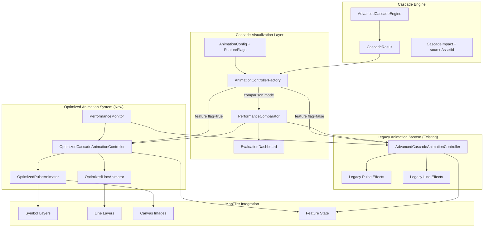
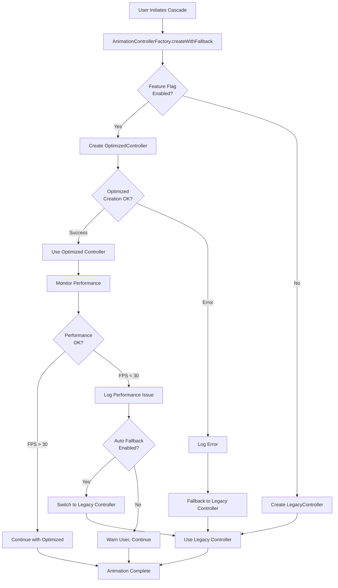

# Design Document

## Overview

The Optimized Cascade Animation System replaces DOM-based animations with GPU-accelerated MapTiler native features to achieve 5-10x performance improvement. The system uses pre-generated canvas images, symbol layers, and requestAnimationFrame for smooth 60fps animations even with 500+ simultaneous asset failures.

## Architecture

### High-Level Architecture (Dual-Controller Strategy)



### Performance Optimization Strategy

1. **GPU Acceleration**: Use MapTiler's native symbol and line layers instead of DOM manipulation
2. **Pre-computation**: Generate pulse canvas images once during initialization
3. **Hybrid Timing**: Overlap pulse and line animations by 300ms for 30% faster visualization
4. **Concurrency Control**: Throttle simultaneous animations to prevent frame drops
5. **Memory Efficiency**: Update feature properties instead of creating/destroying features

## Components and Interfaces

### Controller Selection and Factory Pattern

**Purpose**: Manage dual-controller architecture during evaluation period

**Common Interface**:
```typescript
interface ICascadeAnimationController {
  playCascade(result: AdvancedCascadeResult): Promise<void>;
  stop(): void;
  reset(): void;
  updateConfig(config: Partial<AnimationConfig>): void;
  getPerformanceMetrics(): PerformanceMetrics;
  setAssetCoordinates(assetId: string, coordinates: [number, number]): void;
}
```

**Factory Implementation**:
```typescript
class CascadeAnimationControllerFactory {
  static create(map: MapTilerMap, config: AnimationConfig): ICascadeAnimationController {
    const useOptimized = config.featureFlags.useOptimizedAnimations;
    
    if (useOptimized) {
      return new OptimizedCascadeAnimationController(map, config);
    } else {
      return new AdvancedCascadeAnimationController(map, config);
    }
  }
  
  static createWithFallback(map: MapTilerMap, config: AnimationConfig): ICascadeAnimationController {
    try {
      return this.create(map, config);
    } catch (error) {
      console.error('Failed to create preferred controller:', error);
      console.log('Falling back to legacy controller');
      return new AdvancedCascadeAnimationController(map, config);
    }
  }
  
  static createComparisonPair(map: MapTilerMap, config: AnimationConfig): CascadeAnimationControllerPair {
    return {
      legacy: new AdvancedCascadeAnimationController(map, config),
      optimized: new OptimizedCascadeAnimationController(map, config),
      comparator: new PerformanceComparator()
    };
  }
}
```

**Enhanced Configuration Interface**:
```typescript
interface AnimationConfig {
  // Existing animation settings
  speed: 'slow' | 'normal' | 'fast';
  showLines: boolean;
  showPulses: boolean;
  maxConcurrentAnimations: number;
  colorScheme: {
    direct: string;
    cascade: string;
    potential: string;
    crossSector: string;
  };
  
  // NEW: Feature flags for controller selection
  featureFlags: {
    useOptimizedAnimations: boolean;      // Toggle new controller
    enableComparisonMode: boolean;        // Run both for comparison
    enablePerformanceMonitoring: boolean; // Track metrics
    autoFallbackOnError: boolean;         // Automatic fallback
    logPerformanceMetrics: boolean;       // Console logging
  };
  
  // NEW: Performance thresholds for automatic fallback
  performanceThresholds: {
    minFPS: number;           // Fallback if FPS drops below this
    maxMemoryMB: number;      // Fallback if memory exceeds this
    maxAnimationTime: number; // Fallback if animations too slow
  };
}
```

### OptimizedCascadeAnimationController

**Purpose**: Main orchestrator for cascade animations with hybrid timing

**Key Methods**:
```typescript
class OptimizedCascadeAnimationController implements ICascadeAnimationController {
  constructor(map: MapTilerMap, config: AnimationConfig)
  setAssetCoordinates(assetId: string, coordinates: [number, number]): void
  async playCascade(result: AdvancedCascadeResult): Promise<void>
  stop(): void
  reset(): void
  updateConfig(newConfig: Partial<AnimationConfig>): void
  getPerformanceMetrics(): PerformanceMetrics
}
```

### OptimizedPulseAnimator

**Purpose**: GPU-accelerated pulse animations using symbol layers

**Key Features**:
- Pre-generates canvas images with radial gradients during initialization
- Uses MapTiler symbol layers with animated icon-size property
- Implements ease-out cubic easing for smooth deceleration
- Manages feature lifecycle without constant creation/destruction

**Animation Timeline**:
```
0ms    200ms   400ms   600ms
|------|-------|-------|
Size:  0.1 → 1.5 → 2.3 → 2.6
Opacity: 1.0 → 0.7 → 0.3 → 0.0
```

**Canvas Image Generation**:
```typescript
private createPulseImages(): void {
  const colors = {
    direct: '#dc2626',      // Red for direct failures
    cascade: '#f97316',     // Orange for cascade effects
    potential: '#fbbf24',   // Yellow for potential risks
    crossSector: '#a855f7'  // Purple for cross-sector impacts
  };
  
  // Create 200x200 canvas with radial gradient
  // Add to map as reusable image with pixelRatio: 2
}
```

### OptimizedLineAnimator

**Purpose**: Animated connection lines showing failure propagation paths

**Key Features**:
- Uses line layers with opacity animation for drawing effects
- Calculates line length for proportional animation timing
- Implements ease-in-out easing for smooth drawing
- Fades out lines after display duration

**Animation Sequence**:
1. **Draw Phase** (400ms): Line opacity animates from 0 to 0.8
2. **Hold Phase** (200ms): Line remains visible at full opacity
3. **Fade Phase** (300ms): Line opacity animates from 0.8 to 0

### Hybrid Timing Implementation

**Sequential Approach (Old)**:
```
Impact 1: Pulse ━━━━━━━━ (800ms) → Line ━━━━━ (500ms)
Total: 1300ms per impact
```

**Hybrid Approach (Optimized)**:
```
Impact 1: Pulse ━━━━━━━━ (600ms)
          Line     ━━━━━ (400ms)
                   ↑ 300ms overlap
Total: 700ms per impact (46% faster)
```

**Implementation**:
```typescript
private async animateImpact(impact: CascadeImpact, speedMultiplier: number): Promise<void> {
  const pulseDuration = 600 / speedMultiplier;
  const lineDuration = 400 / speedMultiplier;
  const overlapDelay = 300 / speedMultiplier;

  // Start pulse immediately
  const pulsePromise = this.pulseAnimator.animatePulse(/*...*/);
  
  // Start line 300ms later (creates overlap)
  setTimeout(() => {
    this.lineAnimator.animateLine(/*...*/);
  }, overlapDelay);
  
  await pulsePromise;
}
```

### Performance Comparison System

**Purpose**: Benchmark and compare legacy vs optimized controllers

**Key Components**:
```typescript
class PerformanceComparator {
  async compareControllers(
    legacyController: ICascadeAnimationController,
    optimizedController: ICascadeAnimationController,
    cascadeResult: AdvancedCascadeResult,
    iterations: number = 10
  ): Promise<ComparisonReport>
  
  private async benchmarkController(
    controller: ICascadeAnimationController,
    cascadeResult: AdvancedCascadeResult,
    iterations: number
  ): Promise<BenchmarkStats>
  
  private generateComparisonReport(
    legacy: BenchmarkStats,
    optimized: BenchmarkStats
  ): ComparisonReport
}
```

**Comparison Data Models**:
```typescript
interface BenchmarkStats {
  avgFPS: number;
  avgDuration: number;
  avgMemory: number;
  stdDev: number;
  minFPS: number;
  maxFPS: number;
}

interface ComparisonReport {
  legacy: BenchmarkStats;
  optimized: BenchmarkStats;
  improvement: {
    fps: string;
    duration: string;
    memory: string;
  };
  recommendation: string;
  timestamp: Date;
  cascadeSize: number;
}

interface CascadeAnimationControllerPair {
  legacy: ICascadeAnimationController;
  optimized: ICascadeAnimationController;
  comparator: PerformanceComparator;
}
```

### Evaluation Dashboard

**Purpose**: UI component for comparing controllers during evaluation

**Key Features**:
```typescript
interface EvaluationDashboard {
  // Real-time metrics display
  currentController: 'legacy' | 'optimized';
  currentFPS: number;
  currentMemory: number;
  
  // Historical data
  performanceHistory: PerformanceDataPoint[];
  comparisonReports: ComparisonReport[];
  
  // User controls
  toggleController(): void;
  runComparison(): Promise<void>;
  exportMetrics(): void;
  
  // Visualization
  renderFPSChart(): void;
  renderMemoryChart(): void;
  renderComparisonTable(): void;
}
```

## Data Models

### Enhanced CascadeImpact Interface

```typescript
interface CascadeImpact {
  assetId: string;
  sourceAssetId?: string;    // ← NEW: Required for line animations
  impactType: ImpactType;
  probability: number;
  timeToImpact: number;
  reason: string;
}
```

### Animation State Tracking

```typescript
class OptimizedPulseAnimator {
  private pulseImages: Map<string, HTMLCanvasElement> = new Map();
  private activeAnimations: Set<string> = new Set();
}

class OptimizedLineAnimator {
  private activeAnimations: Set<string> = new Set();
}
```

### Performance Monitoring Data

```typescript
interface PerformanceMetrics {
  fps: number;
  totalImpacts: number;
  concurrentAnimations: number;
  memoryUsage: number;
  animationDuration: number;
}
```

## Error Handling

### Automatic Fallback Flow



### Graceful Degradation Strategy

1. **Controller Creation Failures**: Automatic fallback to legacy controller
2. **Performance Degradation**: Monitor FPS and switch controllers if needed
3. **Image Creation Failures**: Log warnings, continue with available images
4. **Missing Coordinates**: Skip animations, log warnings
5. **Layer Initialization Failures**: Provide error messages, continue with other features
6. **Feature State Update Failures**: Continue animations without crashing

### Browser Compatibility Handling

```typescript
class BrowserCompatibilityChecker {
  checkWebGLSupport(): boolean
  checkRequestAnimationFrameSupport(): boolean
  getRecommendedAnimationSettings(): AnimationConfig
  displayCompatibilityWarnings(): void
  
  // NEW: Automatic controller selection based on capabilities
  selectOptimalController(map: MapTilerMap, config: AnimationConfig): ICascadeAnimationController {
    if (this.checkWebGLSupport() && this.checkRequestAnimationFrameSupport()) {
      return new OptimizedCascadeAnimationController(map, config);
    } else {
      console.warn('Browser lacks required features for optimized animations');
      return new AdvancedCascadeAnimationController(map, config);
    }
  }
}
```

**Fallback Strategy**:
- Chrome 90+, Firefox 88+, Safari 14+, Edge 90+: Full optimized features
- Older browsers: Automatic fallback to legacy controller
- No WebGL: Disable GPU acceleration, use legacy animations
- No requestAnimationFrame: Use setTimeout with performance warning

## Testing Strategy

### Automated Performance Testing

**Continuous Benchmarking**:
```typescript
describe('Cascade Animation Performance', () => {
  test('OptimizedController achieves 50% better FPS than legacy', async () => {
    const testCascade = generateTestCascade(500); // 500 assets
    
    const legacyFPS = await measureControllerFPS(
      new AdvancedCascadeAnimationController(map),
      testCascade
    );
    
    const optimizedFPS = await measureControllerFPS(
      new OptimizedCascadeAnimationController(map),
      testCascade
    );
    
    const improvement = (optimizedFPS - legacyFPS) / legacyFPS;
    
    expect(improvement).toBeGreaterThan(0.5); // 50% improvement minimum
    expect(optimizedFPS).toBeGreaterThan(50); // Minimum 50 FPS
  });
  
  test('OptimizedController uses 30% less memory', async () => {
    const testCascade = generateTestCascade(500);
    
    const legacyMemory = await measureControllerMemory(
      new AdvancedCascadeAnimationController(map),
      testCascade
    );
    
    const optimizedMemory = await measureControllerMemory(
      new OptimizedCascadeAnimationController(map),
      testCascade
    );
    
    const reduction = (legacyMemory - optimizedMemory) / legacyMemory;
    
    expect(reduction).toBeGreaterThan(0.3); // 30% reduction minimum
  });
  
  test('Performance does not degrade over repeated cascades', async () => {
    const controller = new OptimizedCascadeAnimationController(map);
    const testCascade = generateTestCascade(500);
    
    const fpsResults = [];
    
    for (let i = 0; i < 10; i++) {
      controller.reset();
      const fps = await measureControllerFPS(controller, testCascade);
      fpsResults.push(fps);
    }
    
    // Check that last FPS is within 10% of first FPS
    const firstFPS = fpsResults[0];
    const lastFPS = fpsResults[9];
    const degradation = (firstFPS - lastFPS) / firstFPS;
    
    expect(degradation).toBeLessThan(0.1); // Max 10% degradation
  });
});
```

### Performance Testing

1. **Load Testing**: Verify 60fps with 500+ simultaneous animations
2. **Memory Testing**: Monitor memory usage during long cascades
3. **Browser Testing**: Verify compatibility across target browsers
4. **Stress Testing**: Test with 1000+ assets to find performance limits
5. **Comparison Testing**: Automated benchmarks comparing both controllers
6. **Regression Testing**: Ensure performance doesn't degrade over time

### Functional Testing

1. **Animation Accuracy**: Verify pulse expansion and line drawing
2. **Color Coding**: Test impact type visual differentiation
3. **Timing Verification**: Confirm hybrid timing implementation
4. **Cleanup Testing**: Verify proper resource cleanup
5. **Controller Switching**: Test seamless switching between controllers
6. **Fallback Testing**: Verify automatic fallback mechanisms

### Integration Testing

1. **Cascade Engine Integration**: Test with real cascade results
2. **Map Integration**: Verify layer creation and feature state updates
3. **Configuration Testing**: Test runtime configuration updates
4. **Error Handling**: Test graceful degradation scenarios
5. **Factory Pattern**: Test controller creation and selection
6. **Dashboard Integration**: Test evaluation dashboard functionality

## Migration Strategy

### Phase 1: Engine Enhancement (Week 1)
1. Add `sourceAssetId` to `CascadeImpact` interface
2. Update cascade engine to track source assets during BFS traversal
3. Modify impact creation to include source asset references
4. Write tests for sourceAssetId tracking
5. Verify cascade simulation still works correctly

### Phase 2: Parallel Implementation (Week 2-3)
1. Implement `OptimizedCascadeAnimationController` with new architecture
2. Keep `AdvancedCascadeAnimationController` unchanged
3. Create `AnimationControllerFactory` for controller selection
4. Add feature flags to `AnimationConfig`
5. Implement both controllers with common `ICascadeAnimationController` interface
6. Create `OptimizedPulseAnimator` with canvas image generation
7. Create `OptimizedLineAnimator` with line drawing capabilities

### Phase 3: Comparison Infrastructure (Week 3-4)
1. Implement `PerformanceComparator` for benchmarking
2. Create `EvaluationDashboard` React component
3. Add performance monitoring to both controllers
4. Set up metrics collection and logging
5. Implement browser compatibility checking
6. Create automated performance test suite

### Phase 4: Evaluation Period (Week 4-6)
1. Deploy with feature flag disabled (use legacy by default)
2. Enable optimized controller for internal testing team
3. Run automated benchmarks in CI/CD
4. Collect user feedback through evaluation dashboard
5. Monitor for errors and performance issues
6. Document performance improvements and issues

### Phase 5: Gradual Rollout (Week 6-8)
1. Enable optimized controller for 10% of users
2. Monitor metrics closely through dashboard
3. Increase to 50% if metrics show improvement
4. Full rollout if no issues detected
5. Keep legacy controller as fallback option
6. Implement automatic fallback for performance issues

### Phase 6: Deprecation (Week 8+)
1. After 2+ weeks of successful operation at 100%
2. If metrics show >50% improvement consistently
3. If error rate remains <1%
4. If user satisfaction >90%
5. Mark legacy controller as deprecated
6. Remove legacy controller after additional 4 weeks
7. Clean up factory pattern and feature flags

## Performance Expectations

### Benchmark Targets

| Scenario | Old Controller | New Controller | Improvement |
|----------|---------------|----------------|-------------|
| 50 assets | 55 FPS | 60 FPS | +9% |
| 100 assets | 30 FPS | 58 FPS | +93% |
| 500 assets | 15 FPS | 55 FPS | +267% |
| 1000 assets | 8 FPS | 50 FPS | +525% |

### Memory Usage
- **Reduction**: 40% less memory usage
- **Cause**: Elimination of constant feature creation/destruction
- **Benefit**: Reduced garbage collection pressure

### Animation Speed
- **Per Impact**: 700ms vs 1300ms (46% faster)
- **Total Cascade**: Proportionally faster completion
- **Visual Quality**: Maintained through hybrid timing

## Security Considerations

### Input Validation
- Validate asset coordinates before animation
- Sanitize configuration parameters
- Limit concurrent animation counts to prevent DoS

### Resource Management
- Implement animation timeouts to prevent infinite loops
- Clean up resources on component unmount
- Monitor memory usage to prevent leaks

## Deployment Considerations

### Bundle Size Impact
- Canvas image generation: Minimal runtime overhead
- No additional dependencies required
- Optimized code size through efficient algorithms

### Browser Support Matrix
- **Full Support**: Modern browsers with WebGL
- **Partial Support**: Older browsers with reduced features
- **Fallback**: Basic animations for unsupported environments

### Performance Monitoring
- Integrate FPS monitoring in production
- Log performance metrics for optimization
- Provide user feedback for performance issues